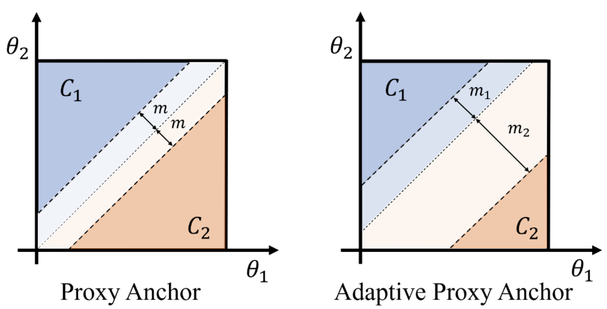

# Adaptive-Proxy-Anchor
Official implementation of Adaptive Proxy Anchor (APA).
We extend the proxy anchor metric learning method to reduce the requirement of expertise and time for selecting the best margin value. The proposed method, called adaptive proxy anchor (APA), adaptively adjusts the margin for corresponding domains during training. APA achieves state of the art on three public datasets, i.e. CUB-200-2011, Cars-196, and SOP, while maintaining the fast convergence rate compared to the proxy anchor method. 

# Benchmarks on CUB, Cars and SOP

# References
 https://github.com/tjddus9597/Proxy-Anchor-CVPR2020. 
